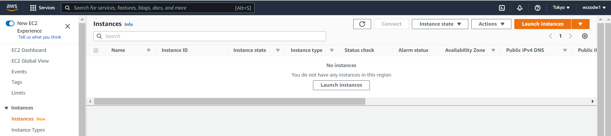
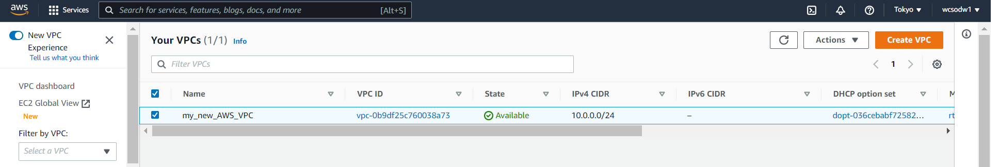

# Amazon EC2(Elastic Compute Cloud) : 

## 1.What is EC2 ? -> Renting a computer in the internet(如同在網路上租一台電腦) 
- 租一台 EC2 電腦 = Instance
- 需要的基本設置 : 
    - A.AMI(Amazon Machine Image), 映像檔, 建立電腦環境 
    - B.Marketplace 選擇AMI相關環境 (ex: Node.js/ Python/ ...等) 
    - C.規格 : 選擇 CPU 記憶體 硬碟 
    - D.網路 : VPC 網路配置, 可先用預設
    - E.防火牆 : Security Group
    - F.標籤 : 為所建立的資源加上標示 
    - G.密碼(!!) : Key Pair(.pem), 作為遠端SSH登入電腦的方式 (!)僅一次可以下載的機會!

## 2. 實作 Create a New INstance :
- 創建instance : 
  - Select AMI type
  - Instance type(instance memory size )
  - Configure Storage(memory size and CPU ...)
  - Name and tags
  - create Security Group
  - key Pair(.pem)

## 3.

## 4.
