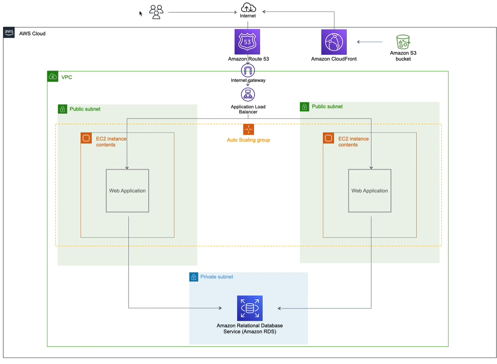
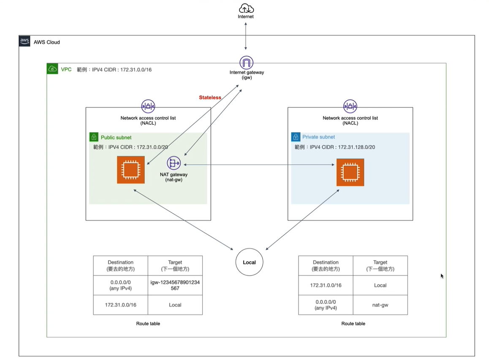

# Amazon VPC(Virtual Private Cloud) : 

## 1.Framework with VPC : 

- Describe framework Flow :  
    - 1.User(使用者/客戶)  
    - 2.Route53  
    - 3.VPC內部之Load Balance將流量分到不同的EC2  
    - 4.EC2 : 查詢資料庫(Optional) or 透過S3將使用者所需的檔案(圖片/影片)回應給終端的使用者  

  
## 2.Public Subnet v.s Private Subnet ? : 
- Subnet?  Subnet為一個可以自由設置VPC網段的集合, 裡面可含有幾千幾萬個IP, 並將很多的IP視為一個子網段.
- Public Subnet v.s Private Subnet ?
    - A.如何區分? 是否能做對外連線的動作!
        可從Route Table是否擁有Internet Gateway去判斷 (IPV4/ IGW(internet gateway))
    - B.Private Subnet能否連線到外部? A:可以!先連到Public Subnet 例外 : nat-gw 能使得private-Subnet 連到 Public
        - 流程 : Private subnet -> 先往 Public subnet -> Internet Gateway(igw) -> Internet

## 3.NACL(Network access control list) : 
- What is NACL? 
    - A.NACL 是一個Subnet Level的防火牆
    - B.範圍 : 以一個Subnet為單位設置防火牆
    - C.Stateless防火牆 : 進出皆要檢查